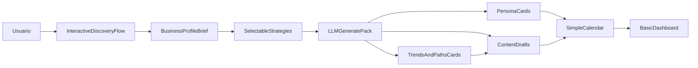
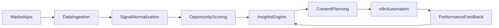

# Plano turbo 2-3 dias para MVP Leeshmo

## Objetivo

Entregar em 2-3 dias um MVP demoável que faça onboarding, gere personas e conteúdo com LLM, organize em calendário simples e apresente dashboard básico, mantendo UX/UI premium.

## Visão unificada do produto (pós-início do MVP)

- Sim: esse onboarding rico existe para criar uma visão única e clara da operação.
- Ele vira a fonte de verdade para:
  - geração de imagem, texto e copy
  - roteirização e automação com n8n
  - distribuição multicanal
  - crescimento (prospecção, pesquisa de mercado e otimização)
- Direção do produto após MVP:
  - evoluir de "gerador de conteúdo" para "sistema operacional de marketing e crescimento".

## Princípio de interação (não form-oriented)

- O fluxo deve ser interativo e orientado a decisões, não apenas um mega formulário em etapas.
- Cada passo combina:
  - perguntas curtas guiadas
  - opções selecionáveis (chips/cards/toggles)
  - inputs livres somente quando necessário
- O sistema propõe caminhos e o usuário cocria:
  - "sugestões de posicionamento"
  - "tendências encontradas"
  - "ângulos de conteúdo"
  - tudo clicável/selecionável para refinamento rápido
- Resultado: experiência de "assistente estratégico" em vez de "preenchimento de formulário".

## Escopo fechado (2-3 dias)

- Onboarding wizard de 6 etapas com coleta profunda de contexto
- Geração de 2-3 personas via LLM
- Geração de 5 conteúdos iniciais (post, roteiro curto, CTA)
- Calendário editorial simples (lista/kanban leve com data e status)
- Dashboard básico (conteúdos gerados, tarefas pendentes, progresso)
- Exportação simples (copy/csv) se sobrar tempo

## O que NÃO entra nesse corte

- Drag-and-drop avançado no calendário
- Integrações reais com redes sociais
- Analytics avançado e recomendações inteligentes
- Automação n8n completa (apenas stub/estrutura opcional)

## Escopo completo pós-MVP (macro)

- Content Studio:
  - geração multimodal (texto/copy/imagem)
  - variações por canal e objetivo
- Distribution Engine:
  - agendamento/publicação multicanal
  - workflows n8n para execução e follow-ups
- Growth Ops:
  - prospecção assistida por ICP e segmentos
  - rotinas de pesquisa de mercado
- Intelligence Layer:
  - tendências e benchmark competitivo
  - recomendações acionáveis com priorização

## Diferencial UX/UI (top tier com pouco tempo)

- Base visual: minimalista (Notion/Linear)
- Acabamento premium: microinterações pontuais (Framer Motion)
- Tailwind com tokens rápidos:
  - Cores: paleta autoral inspirada em fantasia/aventura (Aeternum vibe)
  - Tipografia: Inter (UI) + opcional título display sutil
  - Espaçamento consistente (8pt grid)
- Componentes-chave caprichados:
  - Stepper de onboarding
  - Cards de persona
  - Editor de conteúdo clean
  - Calendário simples com status colorido
- Estados obrigatórios por tela:
  - Loading (skeleton)
  - Empty state guiado
  - Erro com CTA de recuperação

## Identidade visual (homenagem indireta New World: Aeternum)

- Diretriz:
  - capturar atmosfera de mundo vivo, natural e épico
  - evitar cópia literal de assets/logo; usar apenas inspiração de clima e contraste
- Paleta-base proposta (Leeshmo):
  - Fundo base: `#1E1E1E`
  - Fundo secundário/superfícies: `#515160`
  - Primária 1 (amadeirado): `#7A6F4D`
  - Primária 2 (musgo): `#5B7A57`
  - CTA destaque (dourado queimado): `#D6993E`
  - Alerta/ação quente: `#C44E39`
  - Neutro quente 1: `#9F9494`
  - Neutro quente 2: `#C8B8A0`
- Semântica funcional das cores:
  - Sucesso/positivo: variação de verde musgo
  - Aviso: dourado queimado
  - Erro: laranja avermelhado
  - Informativo: azul-acinzentado suave (token auxiliar)
- Aplicação prática no produto:
  - Backgrounds e shells: tons escuros terrosos para profundidade
  - CTAs primários: dourado queimado com contraste AA
  - Ícones/acentos: verde musgo e neutros quentes
  - Cards de tendência e caminhos: combinação de neutros + acento funcional
- Guardrails de UX para manter aparência top tier:
  - mínimo AA para texto e controles; AAA em áreas críticas
  - evitar saturação excessiva em telas analíticas
  - usar cor + forma + ícone para status (não depender só de cor)
  - motion discreto para reforçar decisão, não para decorar

## Onboarding como núcleo estratégico (prioridade máxima)

- Objetivo: capturar o máximo de contexto útil para melhorar qualidade de personas, conteúdo, planejamento e recomendações futuras.
- Estrutura de coleta (6 etapas):
  - Etapa 1 - Negócio e oferta:
    - nome da marca, nicho, categoria, estágio do negócio, local de atuação
    - produto/serviço principal, ticket médio, formato de entrega
  - Etapa 2 - Produto e proposta:
    - proposta de valor, dores que resolve, diferenciais competitivos
    - benefícios principais, objeções comuns, prova social existente
  - Etapa 3 - Estado atual:
    - canais ativos, frequência atual, tipo de conteúdo já publicado
    - métricas atuais (alcance, leads, vendas), gargalos percebidos
  - Etapa 4 - Público e posicionamento:
    - ICP/persona atual, segmento prioritário, tom de voz
    - concorrentes diretos, referências de comunicação e branding
  - Etapa 5 - Escopo e objetivos:
    - meta principal (ex.: leads, vendas, autoridade)
    - horizonte (30/60/90 dias), restrições de equipe/tempo/orçamento
  - Etapa 6 - Monetização e operação:
    - modelo de receita (serviço, assinatura, infoproduto, etc.)
    - funil atual, oferta de entrada, LTV estimado, CAC estimado (se houver)
    - capacidade operacional para execução de calendário
- Requisitos de UX do onboarding:
  - Barra de progresso clara e expectativa de tempo por etapa
  - Autosave por passo + opção de pular campos não obrigatórios
  - Tooltips contextuais com exemplos práticos de resposta
  - Validação instantânea e sumarização final antes de concluir
  - Tela final com "Profile Brief" consolidado para edição rápida
  - Interações mistas por etapa (seleção + input + recomendação clicável)
  - Perguntas adaptativas baseadas nas respostas anteriores
  - "Escolha de caminhos" (ex.: foco em autoridade, leads ou conversão)
  - Revisão assistida por cards editáveis em vez de bloco único de formulário

## Padrões de UI para fluxo interativo

- Componentes obrigatórios:
  - chips de seleção múltipla
  - cards clicáveis com preview de impacto
  - matrizes de prioridade (rápida) para objetivos/canais
  - bloco de "recomendações do sistema" com ações de um clique
- Padrões de comportamento:
  - mostrar 1 decisão por vez quando possível
  - feedback imediato após cada escolha
  - evitar telas densas com muitos campos simultâneos
  - permitir "aceitar sugestão", "editar" ou "descartar" em qualquer recomendação

## Fluxo demo (ponta a ponta)

## Insights & Tendências (sem scraping, só APIs)

- APIs priorizadas:
  - Google Trends
  - YouTube Data API
  - Meta Graph API (Instagram/Facebook)
  - TikTok API oficial
  - X/Twitter API
- Output desejado (fase inicial): pacote completo
  - tendências relevantes por nicho
  - benchmark por canal/referências
  - hipóteses de conteúdo
  - plano de testes priorizado
- Forma de apresentação ao usuário:
  - cards de tendências com score e justificativa curta
  - caminhos recomendados clicáveis ("seguir caminho A/B/C")
  - ações rápidas: "gerar pauta", "adicionar ao calendário", "testar variação"
- Pipeline pós-MVP:
  1) coletar sinais por API
  2) normalizar por tema/intenção/formato
  3) calcular oportunidade (volume, crescimento, aderência ao ICP)
  4) gerar recomendações de pauta e distribuição
  5) enviar ações para calendário e n8n

## Plano de execução (2-3 dias)

### Dia 1: Base + Onboarding + UI System

- Setup do app (layout, navegação, tema, fonte, tokens Tailwind)
- Construção de componentes base (Button, Input, Card, Badge, Tooltip)
- Onboarding interativo em 6 passos (perguntas guiadas + seleções + inputs)
- Microinterações essenciais (transições curtas e feedback visual)
- Implementação dos tokens da paleta temática + validação de contraste

### Dia 2: Núcleo de valor (LLM)

- Endpoint para gerar pacote inicial (personas + conteúdos) baseado no onboarding completo
- Render de personas em cards detalhados e escaneáveis
- Render de conteúdos em editor simples com "regenerar variação"
- Bloco de tendências/caminhos como cards clicáveis para orientar geração
- Tratamento de loading/erro para não quebrar experiência

### Dia 3: Planejamento + Dashboard + Polimento

- Calendário simples com criação/edição de item (data, tipo, status)
- Dashboard básico com 3-4 métricas de progresso
- Revisão visual de consistência (spacing, contraste, hierarquia)
- Teste de roteiro demo completo em menos de 30 min
- Definição de contrato técnico para módulo de insights (schemas e integração futura)

## Critério de pronto (Definition of Done)

- Usuário completa onboarding rico e vê resultado útil em uma sessão
- Sistema gera personas e conteúdos com qualidade demoável
- Calendário recebe itens gerados e permite ajuste rápido
- Dashboard mostra progresso real do fluxo
- UX/UI com acabamento acima da média (consistência + motion + estados)
- Jornada percebida como assistente interativo, não formulário tradicional

## Entrega de alto impacto para apresentação

- Roteiro de demo de 5-7 minutos:
  - Entrada de dados no onboarding
  - Geração automática
  - Ajuste no conteúdo
  - Envio para calendário
  - Visão final no dashboard
- Storytelling visual da marca:
  - "Leeshmo" como identidade de suporte estratégico inteligente
  - atmosfera madura, tática e confiável (fantasia indireta + SaaS moderno)

## Backlog imediato após MVP (próxima onda)

- Conectores API oficiais (sem scraping) para Insights
- Painel de tendências e oportunidades priorizadas
- Conversão de insight em pauta com um clique
- Acionamento de workflows n8n a partir de pautas aprovadas

